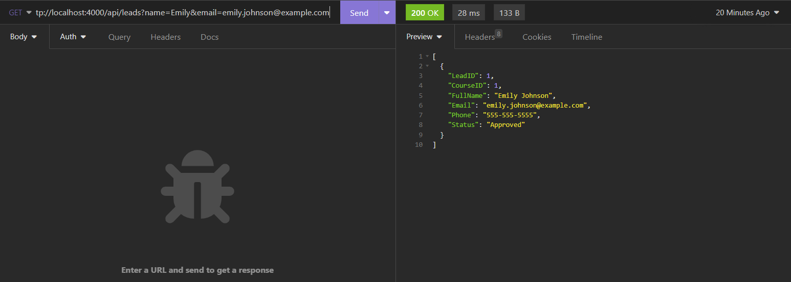
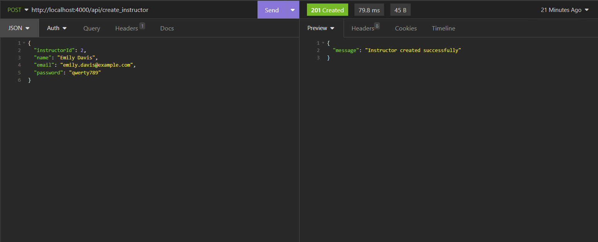
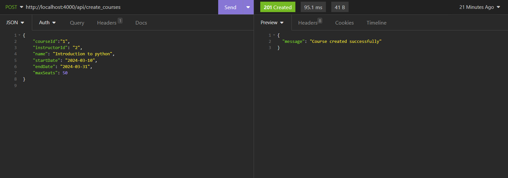
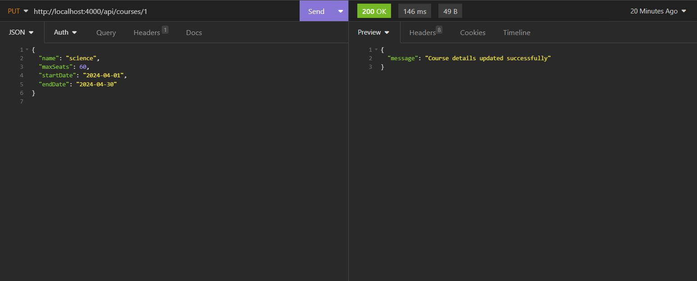
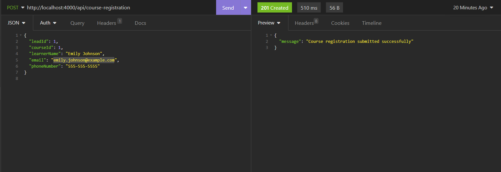
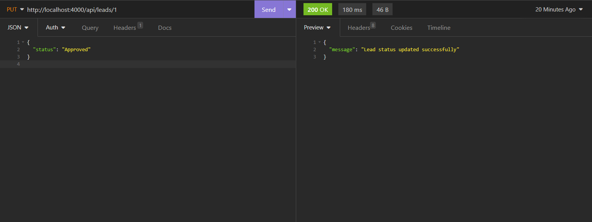
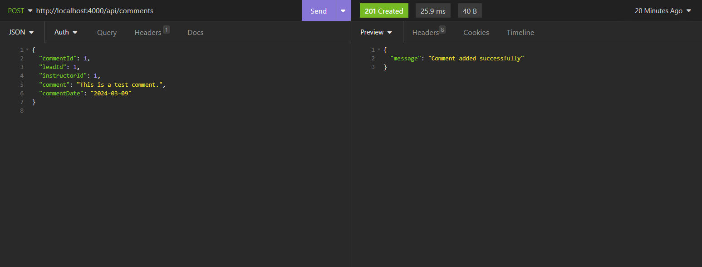

# Airtribe Project

This project is a Node.js application for managing courses, instructors, leads, and comments.

## Endpoints

### Create Instructor

- **URL**: `/api/create_instructor`
- **Method**: `POST`
- **Description**: Creates a new instructor with the provided details.
- **Request Body**:
  ```json
  {
    "instructorId": 1,
    "name": "John Doe",
    "email": "john.doe@example.com",
    "password": "password123"
  }
  ```
- **Response**: 
  - Status: `201 Created`
  - Body:
    ```json
    {
      "message": "Instructor created successfully"
    }
    ```

### Create Course

- **URL**: `/api/create_courses`
- **Method**: `POST`
- **Description**: Creates a new course with the provided details.
- **Request Body**:
  ```json
  {
    "courseId": 1,
    "instructorId": 1,
    "name": "Course Name",
    "startDate": "2024-03-10",
    "endDate": "2024-03-20",
    "maxSeats": 20
  }
  ```
- **Response**: 
  - Status: `201 Created`
  - Body:
    ```json
    {
      "message": "Course created successfully"
    }
    ```

### Update Course

- **URL**: `/api/courses/:id`
- **Method**: `PUT`
- **Description**: Updates the details of a course with the provided ID.
- **Request Body**:
  ```json
  {
    "name": "New Course Name",
    "maxSeats": 30,
    "startDate": "2024-03-15",
    "endDate": "2024-03-25"
  }
  ```
- **Response**: 
  - Status: `200 OK`
  - Body:
    ```json
    {
      "message": "Course details updated successfully"
    }
    ```

### Course Registration

- **URL**: `/api/course-registration`
- **Method**: `POST`
- **Description**: Registers a learner for a course.
- **Request Body**:
  ```json
  {
    "leadId": 1,
    "courseId": 1,
    "learnerName": "Learner Name",
    "email": "learner@example.com",
    "phoneNumber": "1234567890"
  }
  ```
- **Response**: 
  - Status: `201 Created`
  - Body:
    ```json
    {
      "message": "Course registration submitted successfully"
    }
    ```

### Leads Status Update

- **URL**: `/api/leads/:id`
- **Method**: `PUT`
- **Description**: Updates the status of a lead with the provided ID.
- **Request Body**:
  ```json
  {
    "status": "Approved"
  }
  ```
- **Response**: 
  - Status: `200 OK`
  - Body:
    ```json
    {
      "message": "Lead status updated successfully"
    }
    ```

### Leads Search

- **URL**: `/api/leads?name=&email=`
- **Method**: `GET`
- **Description**: Searches for leads by name or email.
- **Query Parameters**:
  - `name`: Name of the lead (optional)
  - `email`: Email of the lead (optional)
- **Response**: 
  - Status: `200 OK`
  - Body: Array of lead objects

### Add Comment

- **URL**: `/api/comments`
- **Method**: `POST`
- **Description**: Adds a comment by an instructor.
- **Request Body**:
  ```json
  {
    "commentId": 1,
    "leadId": 1,
    "instructorId": 1,
    "comment": "This is a comment.",
    "commentDate": "2024-03-10 12:00:00"
  }
  ```
- **Response**: 
  - Status: `201 Created`
  - Body:
    ```json
    {
      "message": "Comment added successfully"
    }
    ```

## Installation

1. Clone the repository:

    ```bash
    git clone https://github.com/VIVEKJHA7777/airtribe.git
    ```

2. Navigate to the project directory:

    ```bash
    cd airtribe
    ```

3. Install dependencies:

    ```bash
    npm install
    ```

## Usage

1. Start the server:

    ```bash
    npm start
    ```

2. The server will start running on port 4000 by default. You can access the endpoints using the provided URLs.

## Build with Docker
   ```bash
   docker build -t airtribe_project .
   docker-compose build --no-cache
   docker compose up -d              
   ```

## Screenshots
* /api/leads (search for leads)



* /api/create_instructor



* /api/create_courses



* /api/courses/:course_id   (for updating courses)



* /api/course-registration



* /api/leads/:leads_id (for updating lead status)



* /api/comments




